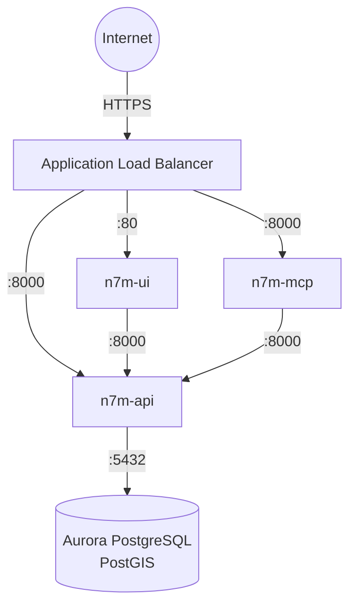

# n7m
Minimalistic Docker images for Nominatim

## About
n7m is a [Numeronym](https://en.wikipedia.org/wiki/Numeronym) for [Nominatim](https://nominatim.org/).

n7m is Nominatim packaged as Docker images deployed on AWS via Ansible, with separation of concerns between the UI, API server, data feed processes, and PostGIS database.

## Overview
The service is composed of:
* **n7m-feed** - The main service for DB creation, updates and downloading files
* **n7m-api** - The API running uvicorn (Python 3.11 + Falcon)
* **n7m-ui** - Web user interface (Nominatim UI v3.5.3)
* **n7m-mcp** - Model Context Protocol server for AI agent integration
* **Aurora PostgreSQL** - Managed database with PostGIS extensions

## Project Structure
```
n7m-swarm/
├── docker/              # Docker image definitions
│   ├── api/             # Nominatim API service (Python/uvicorn)
│   └── ui/              # Web UI (Nominatim UI)
└── ansible/             # AWS infrastructure-as-code
    ├── playbooks/       # Ansible playbooks for AWS services
    ├── library/         # Custom Ansible modules
    └── inventories/     # Environment configurations
```

## Architecture


AWS infrastructure includes: VPC with public/private subnets, NAT Gateway, security groups, bastion host, and CloudWatch logging.

## Deployment

See the [Ansible README](ansible/README.md) for complete instructions.

### Prerequisites
* AWS CLI configured with appropriate credentials
* Python 3.11+ with virtual environment
* Ansible 2.19+

### Quick Start
```bash
cd ansible
# Create an inventory in 'inventories'.  See 'inventories/example' for reference.
make venv        # Create virtual environment
make up          # Deploy all infrastructure
```

The Ansible playbooks provision:
* VPC with public/private subnets across 2 AZs
* Security groups with proper dependency ordering
* Bastion host for SSH access
* EFS for OSM data storage
* Aurora PostgreSQL with PostGIS
* ECS Fargate services for all containers
* Application Load Balancer with HTTPS

## Configuration Hints
For imports and updates, consider these configurations:
* `NOMINATIM_REPLICATION_MAX_DIFF` - you will want to set this to a larger number
* `NOMINATIM_REPLICATION_URL` - you will want to set this to a closer mirror
* `NOMINATIM_IMPORT_STYLE` - Import configuration [`address` | `admin` | `extratags` | `full` | `street`]
* `NOMINATIM_IMPORT_FLAGS` - additional flags you can pass to `nominatim import`

## CI/CD

Container images are built automatically via GitHub Actions:
* Triggered on pull requests, pushes to main, and tags
* Multi-platform builds (linux/amd64, linux/arm64)
* Published to GitHub Container Registry (ghcr.io)

## Documentation

* [Ansible Deployment Guide](ansible/README.md) - Complete AWS infrastructure setup
* [Inventory Configuration](ansible/inventories/README.md) - Environment configuration reference
* [Playbook Organization](ansible/docs/PLAYBOOK_REORGANIZATION.md) - Component separation details
* [Security Groups](ansible/docs/security-groups-diagram.md) - Security architecture diagram

## Resources
* [Nominatim Web Site](https://nominatim.org/)
* [Finding places: an introduction to Nominatim](https://www.youtube.com/watch?v=Q4zgDWY8ng0)
* [OpenStreetMap](https://www.openstreetmap.org/about)
* [OpenStreetMap Data Extracts](http://download.geofabrik.de/)
