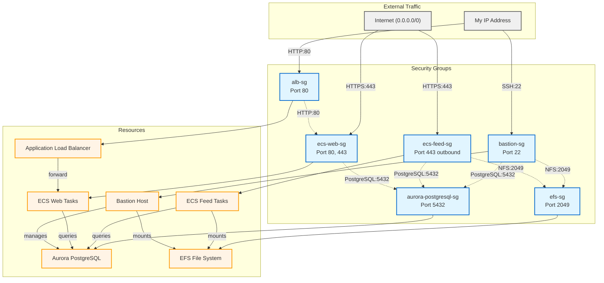

# Security Groups Architecture

## Legend

- **Solid arrows (→)**: External traffic sources and security group attachments
- **Dotted arrows (-.→)**: Inter-security-group access rules
- **Blue boxes**: Security Groups
- **Orange boxes**: AWS Resources
- **Gray boxes**: External traffic sources
